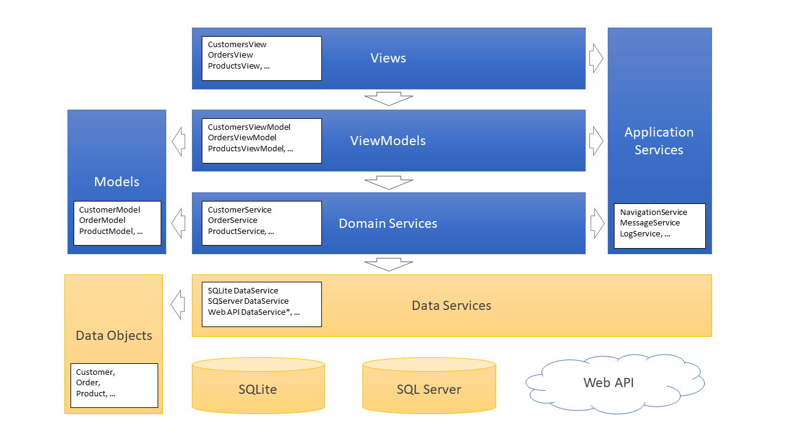

# Architecture
**VanArsdel Inventory Sample** is based on a VMMV architecture pattern to facilitate the separation of the user interface from the business logic of the application. You can read more details about the MVVM pattern in the MVVM section of this documentation.

The following diagram shows the different layers in the application.

## Views
Views are essentially what the user sees on the screen to interact with the application. Examples of views in this application are: CustomersView, OrdersView or ProductsView.

Views contains layers and controls to display the user interface. The layers organize the controls in the view, and the controls show the information to the user. All views depend on a view-model that manage the logic of the User Interface.

## ViewModels
View-models are another essential part in the MVVM architecture pattern. Examples of view-models in this application are: CustomersViewModel, CustomersListViewModel or CustomersDetailsViewModel.

The view-models contain the UI logic of the application, so it is reasonable to believe that there will be, at least, on view-model for each View. In some cases, where the view requires more complexity, more than one view-model are used for a single view.

## Models
Models are the third leg in the MVVM architecture pattern. Examples or models in this application are: CustomerModel, OrderModel or ProductModel.

A model in this application wraps the data of a business object to better expose its properties to the view. In other words, the business object is the raw data received from the data source while the Model is a “view friendly” version, adapting or extending its properties for a better representation of the data.

## Services
View-models make use of Services to execute the operations requested by the user, such as create, update or retrieve a list of customers or products. View-models also make use of Services to log the user activity, show dialogs or display a text in the status-bar by sending a message to the shell view.

Services contains the core functionality of the application. We distinguish two kinds of services:

-	**Application Services** (or Infrastructure Services) – implement core functionality needed by the infrastructure of the application. This functionality in independent of the business of the application and can be reused in other solutions. Examples of application services are Navigation Service or Message Service.
-	**Domain Services** (or Business Services) – implements the functionality specific for the business of the application. Examples of domain services are Customer Services or Product Services that are specific for a product management application.

## Data Services
Domain Services use the Data Services to access and modify the business data. Data can be provided by different data sources such a Database or a Web API.

All Data Services must implement the same contract (IDataService interface), so the Domain Services can access different Data Services regardless of the data source.

In this application two different Data Services are provided:
-	SQLite Data Service – accessing a local SQLite database.
-	SQLServer Data Service – accessing a remote SQL Server or Azure SQL Server

In the settings page of this application you can select the Data Service you want to work with.

