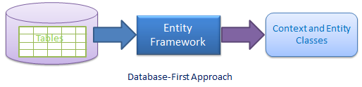

# Data Access

The data we use in the Van Arsdel Inventory app is located in a SQLite local database and we are usnig *Entity Framework Core* to manage the data access.

We will explain the arquitecture of the [.NET Standard](netstandard.md) project **VanArsdelData** included in the app. This project holds the data access logic of the app and it's a cross-platform library that can be shared for example with a Xamarin mobile app, a WPF desktop app, etc. 

Let's explain *Entity Framework Core* first and then we will review how the data access has been implemented in detail. 

## Entity Framework Core

*Entity Framework Core* is a lightweight, extensible, and cross-platform version of the popular Entity Framework data access technology.

*Entity Framework* is an object-relational mapper (ORM) that allow us to work with a database using .Net objects. Also it supports many database engines.

To use *Entity Framwork Core* we need to install the corresponding Nuget package throuh the Package Manager Console:

- `Install-Package Microsoft.EntityFrameworkCore`
- `Install-Package Microsoft.EntityFrameworkCore.Sqlite`
- `Install-Package Microsoft.EntityFrameworkCore.SqlServer`

There are two ways to face a development with *Entity Framework*:

- **Code first**: Code first is when you are facing a development creating the Models before the database. With *Entity Framework* you can generate migration files that will reflect every change you do in your models and it will be applied in the database. This is the approach we are using in the Van Arsdel Inventory app.


<p style="text-align: center;"><b>Figure 1-2</b>: Types of Bindings</p>

- **Database first**: In this case, you already have a database, and the changes you do in the data structure needs to be reflected in your Models code. 



## Models definitions

The database entities are represented in code through models. As we are implementing *database first* development, our model need to have the same fields that have been defined in the database. This is an example of one of the models we use in the app:

```c#
[Table("CountryCodes")]
public partial class CountryCode
{
    [MaxLength(2)]
    [Key]
    public string CountryCodeID { get; set; }

    [Required]
    [MaxLength(50)]
    public string Name { get; set; }
}
```

Let's explain now the *Data Annotations* attributes that we used to define our models.

### Data Annotations

Data Annotations are used to represent certain restrictions that will be reflected in the database entities mapped with our models.

Data Annotations attributes are .NET attributes which can be applied on an entity class or properties to override default conventions in EF Core. These attributes are not only used in Entity Framework but they can also be used with ASP.NET MVC or data controls.

In the model defined above we can distinguish the folowing attirbutes: 

- `[Table("CountryCodes")]`: Entity class attribute to configure the corresponding table name and schema in the database.
- `[Key]`: Property attribute to specify a key property in an entity and make the corresponding column a PrimaryKey column in the database.
- `[MaxLenght(2)]`: Property attribute to specify the maximum string length allowed in the corresponding column in the database.
- `[Required]`: Property attribute to specify that the corresponding column is a NotNull column in the database.

There's also available to use:

- `Timestamp`: Can be applied to a property to specify the data type of the corresponding column in the database as rowversion.
- `ConcurrencyCheck`: Can be applied to a property to specify that the corresponding column should be included in the optimistic concurrency check.
- `MinLength`: Can be applied to a property to specify the minimum string length allowed in the corresponding column in the database.
- `StringLength`: Can be applied to a property to specify the maximum string length allowed in the corresponding column in the database.
- `Column`: Can be applied to a property to configure the corresponding column name, order and data type in the database.
- `ForeignKey`: Can be applied to a property to mark it as a foreign key property.
- `NotMapped`: Can be applied to a property or entity class which should be excluded from the model and should not generate a corresponding column or table in the database.
- `DatabaseGenerated`: Can be applied to a property to configure how the underlying database should generate the value for the corresponding column e.g. identity, computed or none.
- `InverseProperty`: Can be applied to a property to specify the inverse of a navigation property that represents the other end of the same relationship.

## DbContext

`DbContext` is an important class in *Entity Framework Core*. It represent the bridge between our entity models previously explained and the database.


The Van Arsdel Inventory app uses SQLite as the default data source, but is prepared to work with the DbContext of your prefference. There's a different derived class of `DbContext` for each source of data. This is the implementation for SQLite:

```c#
public class SQLiteDb : DbContext, IDataSource
{
    private string _connectionString = null;

    public SQLiteDb(string connectionString)
    {
        // TODO: Remove default connection string
        connectionString = connectionString ?? "Data Source=VanArsdel.db";
        _connectionString = connectionString;
    }

    protected override void OnConfiguring(DbContextOptionsBuilder optionsBuilder)
    {
        optionsBuilder.UseSqlite(_connectionString);
    }

    protected override void OnModelCreating(ModelBuilder modelBuilder)
    {
        modelBuilder.Entity<SubCategory>().HasKey(e => new { e.CategoryID, e.SubCategoryID });
        modelBuilder.Entity<OrderItem>().HasKey(e => new { e.OrderID, e.OrderLine });
    }

    public DbSet<Customer> Customers { get; set; }
    public DbSet<Product> Products { get; set; }
    public DbSet<Order> Orders { get; set; }
    public DbSet<OrderItem> OrderItems { get; set; }

    public DbSet<Category> Categories { get; set; }
    public DbSet<SubCategory> SubCategories { get; set; }

    public DbSet<CountryCode> CountryCodes { get; set; }
    public DbSet<PaymentType> PaymentTypes { get; set; }
    public DbSet<TaxType> TaxTypes { get; set; }
    public DbSet<OrderStatus> OrderStatus { get; set; }
    public DbSet<Shipper> Shippers { get; set; }
}
```

The principal methods of the `DbContext` class are:

| Method |	Usage |
| ------ | ------ |
| Entry	| Gets an DbEntityEntry for the given entity. The entry provides access to change tracking information and operations for the entity. |
| SaveChanges |	Executes INSERT, UPDATE and DELETE commands to the database for the entities with Added, Modified and Deleted state.
| SaveChangesAsync	| Asynchronous method of SaveChanges() |
| Set |	Creates a DbSet<TEntity> that can be used to query and save instances of TEntity. |
| OnModelCreating |	Override this method to further configure the model that was discovered by convention from the entity types exposed in DbSet<TEntity> properties on your derived context. |

### Lifetime

The lifetime of the context begins when the context is declared and finishes when the context is disposed or when is garbage-collected. Therefore, the correct way to use it is with a `using` clause to make sure that the context is disposed after operate with the database:

```c#
using (var context = new SQLiteDb())
{
    ...
}
```


### DbSet

A `DbSet` property is exposed in the `DbContext` class as follows:

`public DbSet<Customer> Customers { get; set; }`

What is does to expose the table *Customers* in a way that we are allowed to query its data using *LinQ*, and execute *Inserts*, *Updates* and *Deletes* over the corresponding table.

Most important methods of DbSet are:

| Method Name  | Description |
| ------------ | ----------- |
| Add  | Adds the given entity to the context with the Added state. When the changes are saved, the entities in the Added states are inserted into the database. After the changes are saved, the object state changes to Unchanged. Example: `dbcontext.Customers.Add(customerEntity)`  |
| Include  | Returns the included non-generic LINQ to Entities query against a DbContext. (Inherited from DbQuery) Example: `var customerList = dbcontext.Customers.Include(s => s.Orders).ToList<Customer>();` |
| Remove | Marks the given entity as Deleted. When the changes are saved, the entity is deleted from the database. The entity must exist in the context in some other state before this method is called. Example: `dbcontext.Customers.Remove(customerEntity);` |

Just accesing a `DbSet` property from our context, it's not executing a query over the database. The query is executed when:

- It is enumerated by a `foreach`.
- It is enumerated by a collection operation such as `ToArray`, `ToDictionary`, or `ToList`.
- LINQ operators such as First or Any are specified in the outermost part of the query.
- The following methods are called: the `Load` extension method on a `DbSet`, `DbEntityEntry.Reload`, and `Database.ExecuteSqlCommand`.

### Commit changes to database

The way *Entity Framework* works is through a `ChangeTracker`. When you work with an entity, you can modify it, or insert a new one or delete it, and these changes will be recorded in the `ChangeTracker` but the changes won't be pushed to the database until the method `SaveChanges` is called:

This is how to use it:

```c#
public async Task<int> UpdateCustomerAsync(Customer customer)
{
    if (customer.CustomerID > 0)
    {
        _dataSource.Entry(customer).State = EntityState.Modified;
    }
    else
    {
        customer.CustomerID = UIDGenerator.Next();
        customer.CreatedOn = DateTime.UtcNow;
        _dataSource.Entry(customer).State = EntityState.Added;
    }
    customer.LastModifiedOn = DateTime.UtcNow;
    customer.SearchTerms = customer.BuildSearchTerms();
    int res = await _dataSource.SaveChangesAsync();
    return res;
}
```

### Other considerations

In order to use *Entity Framework* properly, there are a few things that a developer needs to take into account:

- **Connections**: By default, the context manages connections to the database. The context opens and closes connections as needed. For example, the context opens a connection to execute a query, and then closes the connection when all the result sets have been processed. There are cases when you want to have more control over when the connection opens and closes. For example, when working with SQL Server Compact, opening and closing the same connection is expensive. You can manage this process manually by using the Connection property.

- **Multithreading**: The context is not thread safe. You can still create a multithreaded application as long as an instance of the same entity class is not tracked by multiple contexts at the same time. 