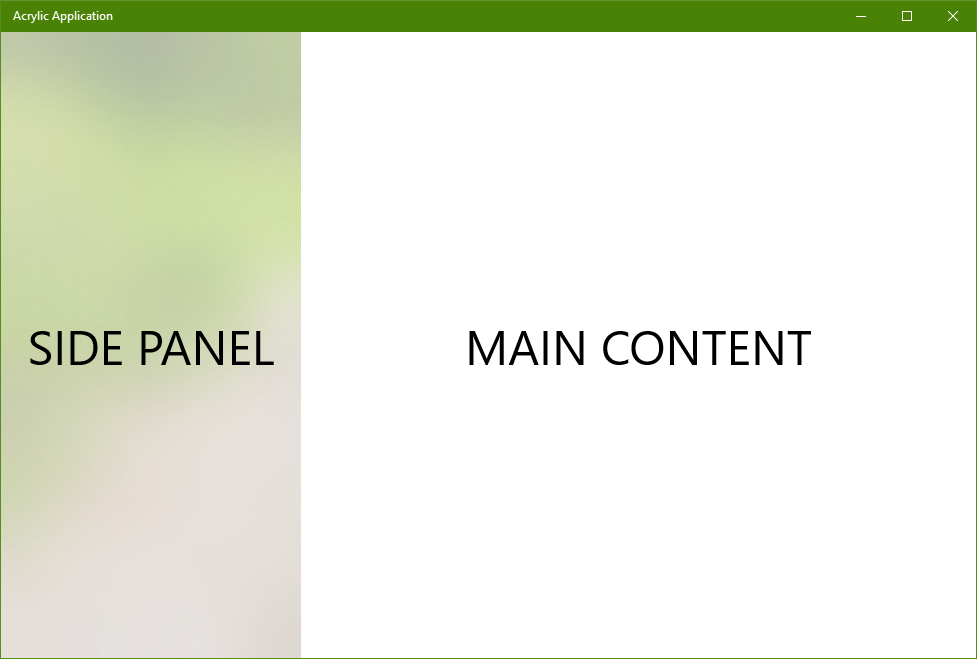
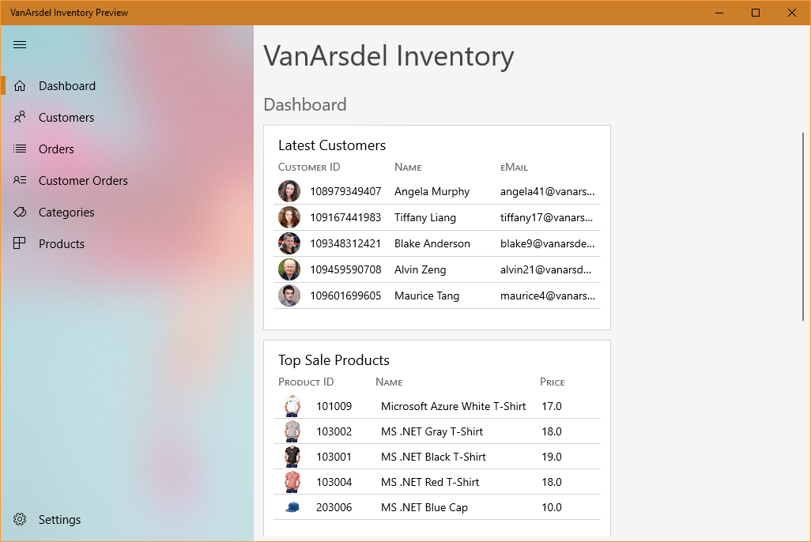
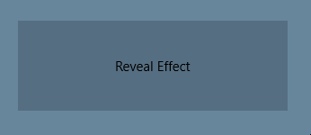

# Fluent Design

## What is Fluent Design?
Fluent Design is an important aspect of any modern Windows 10 application. It's a new design language that sets the guidelines on how the User Interface of an application should look, interact and express in the Windows 10 ecosystem.
Some key aspects of Fluent Design are:
 -	The usage of **transparencies** with **blur effects** that blend naturally with the rest of the system.
 -	Usage of **lightning and shadow effects** that take part in user interactions
 -	**Depth**. Each of the elements of the user interface may be distributed as part of a 3D space, bringing the relevant content at a given time while its context remains behind, making it easier to the user to focus 
-	**Fluid and connected animations**. The elements of the user interface should act and animate and adapt to changes and act upon user interactions.

## Using Fluent Design
### Brushes
If you are familiarized with UWP, you may already know what [Brushes](https://docs.microsoft.com/en-us/windows/uwp/design/style/brushes) are. In short, Brushes are the paint that a Control or any other Visual Element uses to paint itself. For example, setting the Background of a Button to a blue SolidColorBrush, will result in a Button with a blue background. 

Windows 10 offers many other brushes like:
 - [SolidColorBrush](https://msdn.microsoft.com/library/windows/apps/BR242962): Paints the surface with a solid color
 - [LinearGradientBrush](https://msdn.microsoft.com/library/windows/apps/BR210108): Paints the surface with a linear gradient
 - [ImageBrush](https://msdn.microsoft.com/library/windows/apps/BR210101): Paints the surface with an image
 
#### Meet the new Acrylic Brushes
One of the basic and most apparent steps to make an application align with the Fluent Design is the usage of the new **Acrylic brushes**

An Acrylic brush is (another) special kind of brush that you can use to improve the look and feel of your applications. 
#### What makes Acrylic Brushes so special?
While other brushes paint with a color or with using an image, Acrylic Brushes don’t paint on the surface, but they apply a very appealing translucency effect that makes the surface look like a blurry glass. This allows elements of your user interface blend nicely with the rest of the Windows environment, like other windows or elements of the system.

#### Why should we use them?
From a pure design point of view, acrylic brushes help users interact with your application, because **different parts of the layout will look different**, thanks to the material effect (glassy) effects that Acrylic provides. For example, a Master-Detail view will ideally have the Master part painted with an acrylic background, whereas the main content will have a solid color background. This allows the user to easily focus on the content.

The whole reason to use the acrylic brushes is not just because the interface elements look nicer, but most importantly, because different degress of this effect can set a visual hierachy in your interface.

#### Using Acrylic Brushes
There is a whole set of Acrylic Brushes to apply. Fluent Design suggests you to use each of them for specific parts of the user interface.

For example, it's very common to have a navigation **side panel** in your application that allows the user to navigate to other views and sections. This side panel is the perfect candidate to have a translucent effect, like in the aforementioned Master-Detail scenario. Since the user will focus in the content part where the most of interactions will take place, the side panel would benefit the usability of your application when you use the acrylic effect.

Let's see a sample:



XAML:

```xml
<Grid Background="{ThemeResource ApplicationPageBackgroundThemeBrush}">
        
    <Grid.ColumnDefinitions>
        <ColumnDefinition Width="4*"/>
        <ColumnDefinition Width="9*"/>
    </Grid.ColumnDefinitions>

    <Grid Background="{ThemeResource SystemControlChromeHighAcrylicWindowMediumBrush}">
        <TextBlock>SIDE PANEL</TextBlock>
    </Grid>
    <Grid Grid.Column="1">
        <TextBlock>MAIN CONTENT</TextBlock>
    </Grid>

</Grid>
```

Notice the markup with that sets the Background of the first nested Grid: 

`Background="{ThemeResource SystemControlChromeHighAcrylicWindowMediumBrush}"`

As you can see, we are using a special Theme Resource called `SystemControlChromeHighAcrylicWindowMediumBrush`. This is one of the Acrylic Brushes that you can use for your interface. 

There are many others that are used depending on the situation. You can see a detailed explaination of their usage in [this link](https://docs.microsoft.com/en-us/windows/uwp/design/style/acrylic#acrylic-theme-resources).

#### General guidelines

Basically, you'll use 2 different brushes:
 - `SystemControlChromeHighAcrylicWindowMediumBrush` with a **60%** of tint opacity.
 - `SystemControlAcrylicWindowBrush` with a **80%** of tint opacity.

As a rule of thumb:
 - You should only apply Acrylic Brushes to parts of your application that are somewhat secondary, and **leave the main content with a solid background**. Remember that Acrylic is meant to create a **visual hierarchy**. 
 - In **2-level navigation** (simple master-detail, or one side panel), you should apply `SystemControlChromeHighAcrylicWindowMediumBrush`.
 
 
 - In **3-level navigation**, you should apply 
     - `SystemControlChromeHighAcrylicWindowMediumBrush` to the panel that is further away from the main content.
     - `SystemControlAcrylicWindowBrush` to the panel that is closer to the main content.
     
     
 - For **utility applications** (like Calculator, included in Windows), you can apply an Acrylic Brush to the whole window. You can even apply different acrylic transparency level (the opacity tint), since in this kind of applications, the user will likely spend just a little time in them.
 
#### Other recommendations
 - Use it for panes that are on one side of the application, not for inner elements.
 - Don't apply the same acrylic brush to elements that are place together, because it will produce a "seam" effect.
 - Try to avoid applying acrylic to multiple surfaces, or using multiple opacities. Fluent Design-based application will rarely use more than 2 different panes with this effect.

#### NavigationView and Fluent Design

Starting with Windows 10 Fall Creators Update, there is a new control called [NavigationView](https://docs.microsoft.com/en-us/uwp/api/windows.ui.xaml.controls.navigationview). Apart from being useful to easily implement navigation in our app, it's very convenient because it will use Acrylic Brushes (among other Fluent Design) automatically. You won't have to apply any brush to your panes or mess with anything in code. It's ready to use. It's definitely a nice addition to this useful control. 

You can see it in action right here



It's located in `ShellView.xaml`
```xml
<NavigationView x:Name="navigationView" MenuItemsSource="{x:Bind ViewModel.Items}" MenuItemTemplate="{StaticResource NavigationViewItem}"
                SelectedItem="{x:Bind ViewModel.SelectedItem, Mode=TwoWay}" SelectionChanged="OnSelectionChanged"
                IsPaneOpen="{x:Bind IsPaneOpen, Mode=TwoWay}" AlwaysShowHeader="False">

    <Grid>
        <Grid.RowDefinitions>
            <RowDefinition Height="*"/>
            <RowDefinition Height="Auto"/>
        </Grid.RowDefinitions>

        <Frame x:Name="frame">
            <Frame.ContentTransitions>
                <TransitionCollection>
                    <NavigationThemeTransition/>
                </TransitionCollection>
            </Frame.ContentTransitions>
        </Frame>
    </Grid>
</NavigationView>
```

Notice that the XAML doesn't specify any look or appearance style in it. It just applies the Acrylic surface automatically to the sidebar when needed. 

Also, a very handy feature of that NavigationView hels you handle the different states of the layout according to available size, so it can adapt ifself to different form-factors and allowing a satisfactory user experience in each of them. This is also called "UI responsiveness".

## Using Fluent Design
### Animations
Animations are a main concept in Fluent Design. Well-designed animations will make your application a living ecosystem. For example, an element thas has been selected can **zoom in to fill a view**, instead of switching views suddenly, that will help the user understand where it came from. 

In the Universal Windows platform, almost everything can be animated easily. This advantage is well understood in Fluent Design, taking the most out of it to fullfil its principles.

Animations have never been easier. You can add them declaratively in XAML. This is the preferred way to do it, since we encourage adhering to the MVVM architectural pattern where the separation of concers is key. Animations aren't an exception.
### Built-in animations

Depending on which control we are using, animations can be used almost with no effort because they already ready to be used. We will detail some of the most important.

#### Frame
`Frame` is a handy control to handle navigation between different contents. In the improve the experience, we can make it use animations that will be applied to the content being navigated. To do it, just specify a transition animation in its `ContentTransitions`:

```xml
<Frame x:Name="frame">
    <Frame.ContentTransitions>
        <TransitionCollection>
            <NavigationThemeTransition />
        </TransitionCollection>
    </Frame.ContentTransitions>
</Frame>
```

**Notice** that the `ContentTranstions` is a `TransitionCollection`, that will have our transtions.

By setting Frame.ContentTranstions, you are specifying that each time the Frame navigates to some content, a transition animation will play to show the content in an elegant way. This snipped uses the default animation, which makes the content fade in while sliding partially from the bottom to the top of the view.

You can set other animations, like the *DrillInNavigation* animation:
```xml
<Frame x:Name="frame">
    <Frame.ContentTransitions>
        <TransitionCollection>
            <NavigationThemeTransition>
                <NavigationThemeTransition.DefaultNavigationTransitionInfo>
                    <DrillInNavigationTransitionInfo />
                </NavigationThemeTransition.DefaultNavigationTransitionInfo>
            </NavigationThemeTransition>
        </TransitionCollection>
    </Frame.ContentTransitions>
</Frame>
```

This time, the content will zoom in until the view is filled with it in a fast, decelerating pace.

You can learn more about **Frame Content Transitions** [in this page](https://docs.microsoft.com/en-us/uwp/api/Windows.UI.Xaml.Media.Animation.NavigationThemeTransition)

#### ItemsControl (ListView)
`ListView`, along with classes derived from `ItemsControl` have a special property to add built-in animations called `ItemContainerTransitions`. In contrast with `Frame`, `ListView` uses the built-in transtion by default, so you don't have to do anything to use them. You may explicitly set it using a XAML similar to this:
```xml
<ListView Grid.Row="1" ItemsSource="{Binding People}">
    <ListView.ItemContainerTransitions>
        <TransitionCollection>
            <AddDeleteThemeTransition />
        </TransitionCollection>
    </ListView.ItemContainerTransitions>
</ListView>
```
The `AddDeleteTransition` is the default. It will apply a horizontal sliding fade in / fade out animation to the items of the ListView as the are added/removed. There are more, like PopupThemeTransition, that will do the same, but vertically.

#### Other controls

Other controls use animations automatically because they are part of their templates. You don't have to do anything and will look and interact like the should according to the Fluent Design.

For example, elements in a `ListView` will automatically use effects like **Reveal**.

#### Reveal

Reveas is a brand new effect that aligns perfectly with the precepts of Fluent Design. It offers lighning effects over Acrylic surfaces that offert a great visual appearance and reacts to user input, like mouse hovers, taps and clicks.


A number of basic controls will use reveal effects/animations automatically.

- [**ListView**](https://docs.microsoft.com/es-es/windows/uwp/design/controls-and-patterns/lists)
- [**GridView**](https://docs.microsoft.com/es-es/windows/uwp/design/controls-and-patterns/lists)
- [**TreeView**](https://docs.microsoft.com/es-es/windows/uwp/design/controls-and-patterns/tree-view)
- [**NavigationView**](https://docs.microsoft.com/es-es/windows/uwp/design/controls-and-patterns/navigationview)
- [**AutosuggestBox**](https://docs.microsoft.com/es-es/windows/uwp/design/controls-and-patterns/auto-suggest-box)
- [**MediaTransportControl**](https://docs.microsoft.com/es-es/windows/uwp/design/controls-and-patterns/media-playback)
- [**CommandBar**](https://docs.microsoft.com/es-es/windows/uwp/design/controls-and-patterns/app-bars)
- [**ComboBox**](https://docs.microsoft.com/es-es/windows/uwp/design/controls-and-patterns/lists)

However, there are other controls that doesn't have the reveal style by default. Fortunately, Reveal can be enabled using a predefined set of styles.

##### Enabling Reveal on other common controls

These are the controls that can use Reveal using a `Style`.

| Control Name   | Resource Name |
|----------|:-------------:|
| Button |  ButtonRevealStyle |
| ToggleButton | ToggleButtonRevealStyle |
| RepeatButton | RepeatButtonRevealStyle |
| AppBarButton | AppBarButtonRevealStyle |
| SemanticZoom | SemanticZoomRevealStyle |

To illustrate with an example, this is a XAML snippet of a Button with Reveal enabled.



#### Connected animations

##### What's a connected animation?

It's an an animation that applies to a transition of an element between 2 different views.

To illustrate it, nothing is better than seeing it in action.


In the animation, you can see that the tapped item of the initial view is a child item of a list, but after the tap, it becomes the header of the new view. This is what connected animations do: one element is connected and animated during the transition.

The need for this new feature is imposed by the standards of Fluent Design. Transitions should be exactly that: fluent. This means that, apart from offering moving elements that combine perfectly, the transition between views should convey context. This is, that the user should perceive an animation that shows how those elements are linked, as part of a flow, with each navigation / change in the view.

##### What's a connected animation?

Where should they be used?

Connected animations are useful when switching views. They usually are a replacement for the Drill-in transition, and take one shared element between the two views.

##### Implementation

It's consists of 2 steps:
- Prepare
- Start

In the Prepare step, you indicate the system which element of the source view will participate in the connected animation.

You can do it with this code:

```csharp
ConnectedAnimationService.GetForCurrentView().PrepareToAnimate("image", SourceImage);
```

`SourceImage` is the name of the element that will participate in the connected animation and `"image"` is the name of the animation. You can see it as the "key" of the animation.

The next step, Start is where the actual animation takes place. To make it work, you have to call the animation TryStart method:

```csharp
  ConnectedAnimation imageAnimation = 
        ConnectedAnimationService.GetForCurrentView().GetAnimation("image");
    if (imageAnimation != null)
    {
        imageAnimation.TryStart(DestinationImage);
    }
```

##### Connected animations in ListViews and GridViews

Both controls have 2 new methods to animate their items in order to facilitate the creation of connected animations from / to them.

 - ***PrepareConnectedAnimation***
 - ***TryStartConnectedAnimationAsync***

In order to prepare a connected animation from an item, call the `ConnectedAnimationService` like this:

```csharp
void PrepareAnimationWithItem(Person item)
{
     ContactsListView.PrepareConnectedAnimation("portrait", item, "PortraitEllipse");
}
```

Where `item` is the Data Item in the `ListView`/`GridView`. The Data Item is the type of the instance that handling the `ListView`/`GridView`. For instance: A ListView can be bound to a `Collection<Person>` called People. Then, the DataItem is the instance of Person that is represented by the item.

Alternatively, to start the connected animation with an item of a `ListView`/`GridView` as the target (destination) of an animation, for example, when coming back from a detail to the view containing the "hosting" `ListView`/`GridView`, in the destination view we should call the TryStartConnectedAnimationAsync control hosting the item, like this:

```csharp
private void ContactsListView_Loaded(object sender, RoutedEventArgs e)
{
    ContactsItem item = GetPersistedItem(); // Get persisted item
    if (item != null)
    {
        ContactsListView.ScrollIntoView(item);
        ConnectedAnimation animation = 
            ConnectedAnimationService.GetForCurrentView().GetAnimation("portrait");
        if (animation != null)
        {
            await ContactsListView.TryStartConnectedAnimationAsync(
                animation, item, "PortraitEllipse");
        }
    }
}
```

Take into account that this method is the handler of the `Loaded` event, so it will be invoked as soon as the `ListView`/`GridView` is loaded.

In the first line, we are retrieving the item that is the target of the animation (the Data Item, as Person in the example we said previously)

After we have the item, we scroll to it and get the connected animation (with the key).

Finally, we call the `TryStartConnectedAnimationAsync` on the ContactList, that is a `ListView` or a `GridView`, with the correct arguments (the given animation, the item and the name of the element that is shared between origin and destination views.

# Responsive Design

UWP applications can run on a variety of form factors, from tablets to PCs, even inside IoT devices (like Windows IoT Core). Thus, interfaces should take this into account, as part of the Fluent Design principles.

Users can run your application in a 8-inch display on a Tablet, or inside a multi-display configuration using monitors of 27 inches.

Moreover, the user can decide to rotate the device, switching from portrait to landscape and your UI should be usable and adapt smoothly.

You can take as reference the ever rising number of web sites that depending on the device where you are browsing, show one or another layout, that could be completely diferrent, or just the same, with the same elements, but with arranged in a completely different way.

To help users design the UI, the Universal Windows Platform comes with handy mechanisms that helps developers adapt their user interfaces to any situation.

## Adaptive Triggers
This mechanism has been part of UWP from the very beginning. You may already know them, but in case you don't, here you can find an introduction a few samples that you'll get you ready to use them.

### Triggers
A trigger is a declarative rule that will connect a cause with its consequence. In our case, the cause will be a special condition that, when it met, will *trigger* a change.

In the case of Adaptive Triggers, the condition can be that a given Window size has been reached. The consequence can be that a button can be repositioned to another column/row in a grid, for instance.

Let's illustrate it with some code:

```xml
<VisualState x:Name="Big">
	<VisualState.StateTriggers>
		<AdaptiveTrigger MinWindowWidth="600"/>  
	</VisualState.StateTriggers> 
	<VisualState.Setters> 
		<Setter Target="Button1.(Grid.Row)" Value="2"/> 
	</VisualState.Setters> 
</VisualState>
```

This will make the `Button` called "Button1" be inside the Row 2 of its hosting grid **while the Window is 600 DIPs or wider**. 

(**DIP**, Device Independent, is a measurement unit)

Using adaptive triggers, you could perform transformations in a UI to adapt to any form factor.

One common way to do it is using a Grid using columns for the elements in the view when it's landscape and rows when in portrait.

Here a complete example:

```xml
<Page
    x:Class="Composi.MainPage"
    xmlns="http://schemas.microsoft.com/winfx/2006/xaml/presentation"
    xmlns:x="http://schemas.microsoft.com/winfx/2006/xaml"
    xmlns:d="http://schemas.microsoft.com/expression/blend/2008"
    xmlns:mc="http://schemas.openxmlformats.org/markup-compatibility/2006"
    mc:Ignorable="d">


    <Grid>

        <VisualStateManager.VisualStateGroups>
            <VisualStateGroup>
                <VisualState x:Name="Lanscape">
                    <VisualState.StateTriggers>
                        <AdaptiveTrigger MinWindowWidth="600" />
                    </VisualState.StateTriggers>

                    <VisualState.Setters>
                        <Setter Target="Border2.(Grid.Row)" Value="0" />
                        <Setter Target="Border2.(Grid.Column)" Value="1" />
                        <Setter Target="ColumnDefinition.Width" Value="*" />
                        <Setter Target="RowDefinition.Height" Value="Auto" />
                    </VisualState.Setters>

                </VisualState>

            </VisualStateGroup>
        </VisualStateManager.VisualStateGroups>

        <Grid.ColumnDefinitions>
            <ColumnDefinition />
            <ColumnDefinition x:Name="ColumnDefinition" Width="Auto" />
        </Grid.ColumnDefinitions>

        <Grid.RowDefinitions>
            <RowDefinition />
            <RowDefinition x:Name="RowDefinition" />
        </Grid.RowDefinitions>

        <Border x:Name="Border1" Background="LawnGreen" />
        <Border x:Name="Border2" Grid.Row="1" Grid.Column="0" Background="Green" />
    </Grid>
</Page>
```

There is a single Adaptive Trigger in the Page that will active when the Width of the page is 600 or wider.

Upon this change, the Border called "Border2" will switch from row 1 to row 0, and from column 0, to column 1. Also, The width of the second column definition and row definition are switched values (from "Auto" to "*" and viceversa), so they will collapse automatically (otherwise, there would be an empty espace in both rows and columns (50% of the space, to be exact).

As said before, this is a common technique, but it's not always necessary, because there a controls that encapsulate this adaptive behavior themselves.

For instance, we have the NavigationView, that adapts itself to the available space, hiding or showing the navigatable side panel.

### Master-Detail

In other scenarios, like master-detail scenarios, it's common to show both views side by side when there is enough space, and to hide one of them when there isn't. In this case we should handle the use of the back button, or create a way to go back from the details view to the master view.

In these scenarios we have to keep track of the current selected item. 

A common way to do it is checking whether the selected item in the master list is null. If this happens, the detail view should have `Visibility=Collapsed`. When the user selected one item, the Detail should be turned Visible (`Visibility=Visible`) and the Back Button should be shown (so the user can go back).

This situation is so common that there are already controls that encapsulate the whole behavior, like the [MasterDetailsView](https://docs.microsoft.com/es-es/windows/uwpcommunitytoolkit/controls/masterdetailsview) of [UWP Community Toolkit](https://github.com/Microsoft/UWPCommunityToolkit)

# Visual Layer

## What is Visual Layer?

The Visual Layer is a layer between the Windows UWP XAML layer and DirectX that allows indirect access to drawing primitives. This gives developers great flexibility when it comes to rendering custom controls that require complex render features or animations, while keeping the same philosophy that XAML provides in terms of simplicity and high-level APIs.

## Visual Layer

In order to work with the Visual Layer we have to get a Visual. A Visual is an abstraction of anything that can be rendered on the screen. Every UIElement has an underlying Visual that can be retrieved using a helper class from the `Windows.UI.Composition` namespace, called `ElementCompositionPreview`.

For instance, given a Canvas in a XAML view (the class Canvas control) like this:

```xml
<Canvas x:Name="Canvas">
```

We can get its visual calling

```csharp
Visual hostVisual = ElementCompositionPreview.GetElementVisual(Canvas);
```

In order to be able to create a composition to render on the Canvas, we must then create a `Composer`. The `Composer` class is a factory that will construct the objects that will take part into a composition.

How do we get the Composer? From the Compositor property of the Visual.

```csharp
Compositor compositor = hostVisual.Compositor;
```

Once we get it, we can add figures to the composition using methods like `Compositor.CreateSpriteVisual()`

For example, in this code, we're creating a rotated rectangle:
  
```csharp
 var rectangle = compositor.CreateSpriteVisual();

rectangle.Size = new Vector2(6.0f, 5F);
rectangle.Brush = compositor.CreateColorBrush(Colors.Blue);
rectangle.Offset = new Vector3(100f, 0.0f, 0);
rectangle.CenterPoint = new Vector3(3.0f, 100.0f, 0);
rectangle.RotationAngleInDegrees = 45;

// Add the shadow as a child of the host in the visual tree
ElementCompositionPreview.SetElementChildVisual(Canvas, rectangle);     
```

Notice the last line. It adds the composed rectangle as the last child of the element. This way, the rectangle will be rendered over every other element that the `Canvas` would have.

This is a pretty basic usage of the Visual Layer that will let you understand what's going on under the hood.

## Advanced scenarios

Compositions can be are complex as you wish. 

There are other features like
- Animations
- Effects
- Spotlights
- Transparencies
- Brushes

You can refer to the [Visual Layer Documentation](https://docs.microsoft.com/en-us/windows/uwp/composition/visual-layer) to get a full specification of the Composition API.

# Multiple Windows

There has been a trend in the last years to cut down the need to pop-up new windows in modern applications. This has to do with the huge grow of mobile applications, that, due to the restricted size of most smartphone screens, had to reduce the amount of data displayed, and resorted to page navigation instead of creating new windows. Those pages occupied to whole screen, and IU flows started to be linear. 

Motivated by this new approach and the convergence between the mobile and the classic Desktop worlds, the Single Page Application paradigm was on the rise. Soon, most applications started to integrate every element of the User Interface into the same `Window`, and Pages got the main role while separate windows became less and less used to the point that their use is discouraged, favoring navigation.

Almost any application can be rethought as SPA, with little to no impact in the user experience. Navigation does a great job in the 99% of cases.

## Enterprise applications usually need more Windows

In the context of a LOB application, it's frequent that the user needs to switch contexts. Users need to query or edit data from different parts of the application, or mabye to hold data entry until other processes finish. There is a wide range of scenarios that would benefit from having separate windows to allow multitasking.

Windows 10 Platform offers the posibility to create new windows in the application to help users improve their productivity.

## How to create a new Window

This is a small recipe method to create a new `Window` in UWP:

```csharp
public async Task<int> CreateNewViewAsync(object viewModel)
{
    int viewId = 0;

    var newView = CoreApplication.CreateNewView();
    await newView.Dispatcher.RunAsync(CoreDispatcherPriority.Normal, () =>
    {
        viewId = ApplicationView.GetForCurrentView().Id;

        var frame = new Frame();
        `Window`.Current.Content = frame;
        `Window`.Current.Activate();
        frame.DataContext = viewModel;
    });

    if (await ApplicationViewSwitcher.TryShowAsStandaloneAsync(viewId))
    {
        return viewId;
    }

    return 0;
}
```

Basically, where are:
1. Creating the `Window` and 
2. Telling its Dispatcher to execute the setup code for the `Window`
   1. Getting the **managed `Window` Id** (`viewId`) of the `Window`
   2. Set its Content (here, a `Frame`)
   3. Activate it
   4. Setting the `DataContext` (really useful to apply MVVM)
3. Trying to show it
4. Returning the **managed `Window` Id**, that is a handle to identify the `Window` since some calls need it.

Notice that there is no reference to the word "Window" in any method, but in fact, a View in UWP in this context refers to what we commonly know as `Window`. 

So, this is all. Executing this code will get a new `Window` with its DataContext set. Of course, you can set the content of the `Window` to any `Page` to customize what is rendered inside the `Window`.

## Guidelines to Multiple Windows

- Important: Enable new windows in an app **for scenarios that enhance productivity and enable multitasking**.
- Provide a way for the user to navigate from a secondary `Window` back to the main `Window`.
- Provide a clear way for the user to open a new `Window`. For example, add a `Button` to the app bar for opening a new `Window`. 
- Make sure the title of the new `Window` reflects the contents of that `Window`. The user should be able to differentiate between the windows of an app based on the title.
- Subscribe to the [Consolidated event](https://msdn.microsoft.com/en-us/library/windows/apps/windows.ui.viewmanagement.applicationview.consolidated.aspx) and, when the event fires, close the `Window`'s contents. The consolidated event occurs when the `Window` is removed from the list of recently used apps or if the user executes a close gesture on it.
- If the new `Window` replaces the original app `Window`, provide custom animation when the windows switch.
- Design new windows that allow users to accomplish tasks entirely within the `Window`.
- Don't automatically open a new `Window` when a user navigates to a different part of the app.  
- Don't require the user to open a new `Window` to complete flows in the application.
