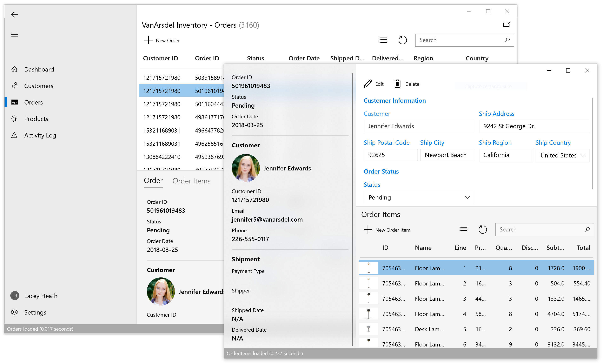

# Introduction
During the development of an enterprise app, we as developers, must face several challenges as:
- App requirements that can change over time.
- New business opportunities and challenges.
- Ongoing feedback during development that can significantly affect the scope and requirements of the app.

With these in mind, it's important to build apps that can be easily modified or extended over time. Designing for such adaptability can be difficult as it requires an architecture that allows individual parts of the app to be independently developed and tested in isolation without affecting the rest of the app.

An effective remedy for these challenges is to partition an app into discrete, loosely coupled components that can be easily integrated together into an app. Such an approach offers several benefits:
- It allows individual functionality to be developed, tested, extended, and maintained by different individuals or teams.
- It promotes reuse and a clean separation of concerns between the app's horizontal capabilities, such as authentication and data access, and the vertical capabilities, such as app specific business functionality. This allows the dependencies and interactions between app components to be more easily managed.
- It helps maintain a separation of roles by allowing different individuals, or teams, to focus on a specific task or piece of functionality according to their expertise. In particular, it provides a cleaner separation between the user interface and the app's business logic.

Before proceeding to decouple the app in different components, it's important to choose the design patterns that will help us to do it properly. These are the patterns we have decided to choose for the Inventory App:

- **Model-View-ViewModel (MVVM)**: Windows 10 enterprise apps are specially design to apply this pattern to decouple the business logic, the presentation logic and the UI views.
- **Dependency Injection**: Dependency injection containers reduce the dependency coupling between objects by providing a facility to construct instances of classes with their dependencies injected, and manage their lifetime based on the configuration of the container.
- **Messaging**: Message-based communication between loosely coupled components.
- **Navigation**: Define how the Navigation will work, and where the Navigation logic will reside.
- **Data Access**: Define how to connect with data sources and the technology to use for that purpose.

This guide not only explain in detail each of the patterns used, it also shows you how are being applied in the Inventory Sample app.

## The VanArsdel Inventory Sample
**VanArsdel Inventory Sample** is an enterprise desktop application for Windows 10 focused on Line of Business scenarios and implementing best patterns and practices to solve common enterprise requirements.

This application simulates a real-world scenario where you can manage customers, orders and products of a fictitious company called VanArdsel.

The application solution has been divided in three decoupled projects, and each of them represents an important role in the app:

 | Project | Description |
 | ------- | ----------- |
 | Inventory.Data | .NET Standard project with the data access logic of the application |
 | Inventory.ViewModels | .NET Standard project representing the business and the presentation logic of the application
 | Inventory.App | The Windows 10 executable application containing the User Interface and services implementation |

 ### The Inventory.Data project
 This project is a .NET Standard Library with the main purpose of interact with a database through the *Entity Framework Core*. It also contains the definitions of the DTOs (*Data Transfer Objects*) of the application.

 ### The Inventory.ViewModels project
This project is a .NET Standard Library containing the presentation logic and infrastructure components of the application. This project is agnostic of the platform used by the application. A special attention is required for its folder structure:

 | Folder | Description |
 | ------ | ----------- |
 | Infrastructure | This folder contains the infrastructure services as well as the base class for Models and ViewModels |
 | Models | Application Domain Models |
 | Services | Application Domain Services |
 | ViewModels | ViewModels classes with the presentation logic of the application |

### The Inventory.App project
This project is the Windows 10 executable application. It contains platform specific implementations of the app like services and the User Interface.

