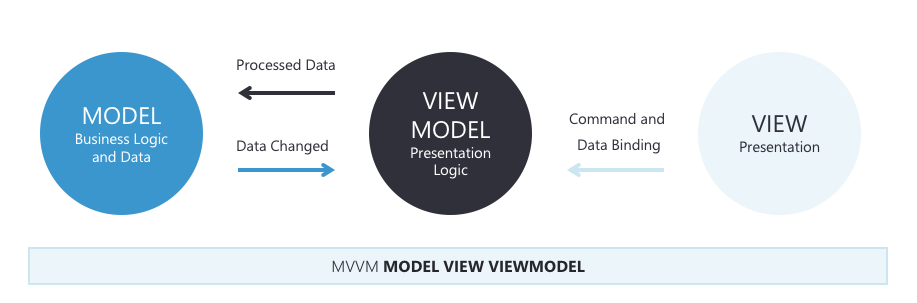

# MVVM

The UWP developer experience typically involves creating a user interface in XAML, and then adding code-behind that operates on the user interface. As apps are modified, and grow in size and scope, complex maintenance issues can arise. These issues include the tight coupling between the UI controls and the business logic, which increases the cost of making UI modifications, and the difficulty
of unit testing such code.

The Model-View-ViewModel (MVVM) pattern helps to cleanly separate the business and presentation logic of an application from its user interface (UI). 

Maintaining a clean separation between application logic and the UI helps to address numerous development issues and can make an application easier to test, maintain, and evolve. It can also greatly improve code re-use opportunities and allows developers and UI designers to more easily collaborate when developing their respective parts of an app.

## The MVVM Pattern

There are three core components in the MVVM pattern: the model, the view, and the view model. Each serves a distinct purpose. Figure 1-1 shows the relationships between the three components.



<p style="text-align: center;"><b>Figure 1-1</b>: The MVVM pattern</p>

- **Model**: The data layer and the business logic of our app. It is also referred to as the domain object.

- **View**: User interface.

- **View Model**: Presentation Logic. Its role is to intermediate between the Model and the View. The View-Model contains the state of the view and communicates with it through Data Binding, Commands and Notifications.

In addition to understanding the responsibilities of each components, it's also important to understand how they interact with each other. At a high level, the view "knows about" the view model, and the view model "knows about" the model, but the model is unaware of the view model, and the view model is unaware of the view. Therefore, the view model isolates the view from the model, and allows the model to evolve independently of the view.

The benefits of using the MVVM pattern are as follows:

- The separation the user interface from the rest of the code means that designers can focus on the view, while developers can work
on the view model and model components.

- Developers can create unit tests for the view model and the model, without using the view. The unit tests for the view model can exercise exactly the same functionality as used by the view.

- The app UI can be redesigned without touching the code, provided that the view is implemented entirely in XAML. Therefore, a new version of the view should work with the existing view model.

- The View-Models and the Model component could be re-use in order to develop other versions of the app or the same app for other platforms.

The following sections discuss in detail the responsibilities of each of the component of the MVVM pattern.

## Model

Model classes are non-visual classes that encapsulate the app's data. Therefore, the model can be thought of as representing the app's domain model, which usually includes a data model along with business and validation logic. Examples of model objects include data transfer objects (DTOs), Plain Old CLR Objects (POCOs), and generated entity and proxy objects.

Model classes are typically used in conjunction with services or repositories that encapsulate data access and caching.

## View

The view is responsible for defining the structure, layout, and appearance of what the user sees on screen. Ideally, each view is defined in XAML, with a limited code-behind that does not contain business logic. However, in some cases, the code-behind might contain UI logic that implements visual behavior that is difficult to express in XAML, such as animations.

> **Tip:** Avoid enabling and disabling UI elements in the code-behind

> Ensure that view models are responsible for defining logical state changes that affect some aspects of the view's display, such as whether a command is available, or an indication that an operation is pending. Therefore, enable and disable UI elements by binding to view model properties, rather than enabling and disabling them in code-behind.

## View Model

The view model implements properties and commands to which the view can data bind to, and notifies the view of any state changes through change notification events. The properties and commands that the view model provides define the functionality to be offered by the UI, but the view determines how that functionality is to be displayed.

> **Tip:** Keep the UI responsive with asynchronous operations

> UWP apps should keep the UI thread unblocked to improve the user's perception of
performance. Therefore, in the view model, use asynchronous methods for I/O operations and raise events to asynchronously notify views of property changes.

The view model is also responsible for coordinating the view's interactions with any model classes that are required. There's typically a one-to-many relationship between the view model and the model classes. 

Each view model provides data from a model in a form that the view can easily consume. To accomplish this, the view model sometimes performs data conversion. Placing this data conversion in the view model is a good idea because it provides properties that the view can bind to. For example, the view model might combine the values of two properties to make it easier for display by the view, or maybe the view doesn't really need to display the whole model's data and only part of the model will be offered to the view by the View Model.

> **Tip:** Centralize data conversions in a conversion layer

> It's also possible to use converters as a separate data conversion layer that sits between the view model and the view. This can be necessary, for example, when data requires special formatting that the view model doesn't provide.

For collections, the view-friendly `ObservableCollection<T>` is provided. This collection implements collection changed notification, relieving the developer from having to implement the `INotifyCollectionChanged` interface on collections.

## View First vs ViewModel First

View First / ViewModel First refers to whether you build the app top down or bottom up.

- *View first*: The Views is the first thing to implement during development and then a ViewModel that matches. The development is focused on creating the Views before the ViewModels and therefore the navigation between them is a responsability of the Views.

- *View Model first*: The ViewModel is the first element created during development and then the View that matches. The ViewModel is responsable of creating the View associated with it. We will also need to create an abstraction of the Navigation between Views, and manage this Navigation in our ViewModels (usually through an IoC container or a Service Locator pattern).

## Binding object

*Binding object* is the piece that transfers data values from the source to the target, and optionally from the target back to the source.

In the traditional `{Binding}` approach, the ViewModel has to be associated to the `DataContext` dependency property that is exposed by the View. For more information check section: [Windows 10 Binding](windows-10-binding.md).

## Data Binding

The Data Binding is the mechanisism in place to communicate the View with the View Model. It relates 2 properties keeping them syncronized.

In order for the view model to participate in data binding with the view, its properties must raise the `PropertyChanged` event. View models satisfy this requirement by implementing the `INotifyPropertyChanged` interface, and raising the `PropertyChanged` event when a property is changed.

This is an example of how to implement the `INotifyPropertyChanged` interface:

```csharp
public class ModelBase : INotifyPropertyChanged
{
    public event PropertyChangedEventHandler PropertyChanged;

    protected bool Set<T>(ref T field, T newValue = default(T), [CallerMemberName] string propertyName = null)
    {
        if (!EqualityComparer<T>.Default.Equals(field, newValue))
        {
            field = newValue;
            NotifyPropertyChanged(propertyName);
            return true;
        }
        return false;
    }

    protected void NotifyPropertyChanged([CallerMemberName] string propertyName = null)
    {
        PropertyChanged?.Invoke(this, new PropertyChangedEventArgs(propertyName));
    }
}
```

### Types of Bindings.

We can differentiate 3 types of bindings:

#### One-Time Binding:
The value of the View Model property will be informed to the View just one time, normally when the View is being loaded. There are two ways to implement this time of binding:

- Creating a simple property in the View Model and bind the property to the View:

```c#
// View Model property
public string Name { get; set; }
```
```xml
<!--XAML binding-->
<TextBlock Text="{x:Bind Name}" />
```

- Creating a property in the View Model that will indicate changes raising the PropretyChanged event, and indicating the binding mode `OneTime` in XAML:

```c#
// View Model property
private string _name;
public string Name
{
    get => _name;
    set => Set(ref _name, value);
}
```
```xml
<!--XAML binding-->
<TextBlock Text="{x:Bind Name, Mode=OneTime}" />
```

#### One-Way Binding:
The value of the View Model property can change more than one time, and it will update the View. If we change the target View property, changes won't be reflected in the View Model.

```c#
// View Model property
private string _name;
public string Name
{
    get => _name;
    set => Set(ref _name, value);
}
```
```xml
<!--XAML binding-->
<TextBlock Text="{x:Bind Name, Mode=OneWay}" />
```

#### Two-Way Binding:
The value of the View Model property can change more than one time, it will update the View and can be updated back by changing the target View property.

```c#
// View Model property
private string _name;
public string Name
{
    get => _name;
    set => Set(ref _name, value);
}
```
```xml
<!--XAML binding-->
<TextBlock Text="{x:Bind Name, Mode=TwoWay}" />
```

## Commands

There's another method of communication between the View and View Model: the **Commands**.

`Commands` are implementation of the interface `ICommand` of the .Net framework, and are used to bind view "event handlers" to the View Model. For example the event click of a `Button` control.

One of the big problems with event handlers is that they can create a tight coupling between the instance that exposes the event and the instance that subscribes to it. This is a frequent cause for memory leaks in .NET. 

When we use a `Command` to expose the “event handler” and bind the UI element to that `Command` using data-binding, we are creating a loosely coupled relation and therefore preventing possible memory leaks.

Let see how to use them:

```c#
// Command defined in our ViewModel
public ICommand EditCommand => new RelayCommand(Edit);
private void Edit()
{
    BeginEdit();
}
```

```xml
<!--Binding the Commands in XAML-->
<controls:Details x:Name="details"
            DetailsContent="{x:Bind ViewModel}"
            DetailsTemplate="{StaticResource DetailsTemplate}"
            IsEditMode="{x:Bind ViewModel.IsEditMode, Mode=OneWay}"
            EditCommand="{x:Bind ViewModel.EditCommand}"
            DeleteCommand="{x:Bind ViewModel.DeleteCommand}"
            SaveCommand="{x:Bind ViewModel.SaveCommand}"
            CancelCommand="{x:Bind ViewModel.CancelCommand}" />
```

## Summary

MVVM arquitecture is the most extended practice developing Windows 10 enterprise apps. It helps to cleanly separate the business and presentation logic of an application from its user interface (UI). Maintaining a clean separation between application logic and the UI helps to address numerous development issues and can make an application easier to test, maintain, and evolve. It can also greatly improve code re-use opportunities and allows developers and UI designers to more easily collaborate when developing their respective parts of an app.