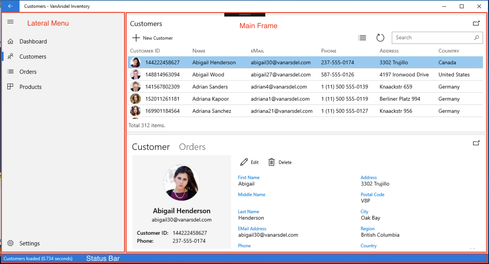
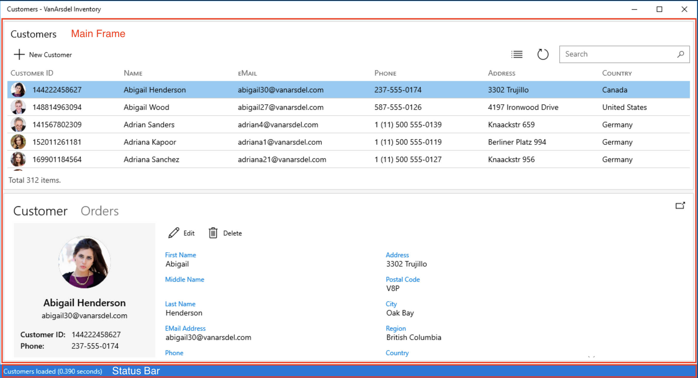

## App Shell views and Navigation

All the views in the Inventory app have a commun design and we can group the different views between two master pages or shells:

### MainShellView 
It's composed by a lateral menu, a main `Frame`, and a status bottom bar:



This is the XAML representation of the view:

```xml
<Grid Background="{ThemeResource ApplicationPageBackgroundThemeBrush}">
    <Grid.RowDefinitions>
        <RowDefinition Height="*"/>
        <RowDefinition Height="Auto"/>
    </Grid.RowDefinitions>

    <NavigationView x:Name="navigationView" MenuItemsSource="{x:Bind ViewModel.Items}" MenuItemTemplate="{StaticResource NavigationViewItem}"
                    SelectedItem="{x:Bind ViewModel.SelectedItem, Mode=TwoWay}" SelectionChanged="OnSelectionChanged"
                    IsPaneOpen="{x:Bind ViewModel.IsPaneOpen, Mode=TwoWay}" AlwaysShowHeader="False">

        <Grid>
            <ProgressRing IsActive="{x:Bind ViewModel.IsBusy}" />
            <Frame x:Name="frame">
                <Frame.ContentTransitions>
                    <TransitionCollection>
                        <NavigationThemeTransition/>
                    </TransitionCollection>
                </Frame.ContentTransitions>
            </Frame>
        </Grid>
    </NavigationView>

    <Grid Grid.Row="1" Background="{ThemeResource SystemControlAccentAcrylicElementAccentMediumHighBrush}">
        <Rectangle Fill="IndianRed" Visibility="{x:Bind ViewModel.IsError, Mode=OneWay}" />
        <TextBlock Margin="6,4" Text="{x:Bind ViewModel.Message, Mode=OneWay}" Foreground="White" FontSize="12" />
    </Grid>
</Grid>
```

The `NavigationView` control represents the menu, and we can identify inside it the main Frame where our content will be changed when we select a new menú option. At the end of the main Grid we can identify the *Status Bar* where we will display the status of the user actions when interacts with the app.

### ShellView

It has the same structure of the `MainShellView` but without the Lateral Menu:



The XMAL markup for this shell is:

```xml
<Grid Background="{ThemeResource ApplicationPageBackgroundThemeBrush}">
    <Grid.RowDefinitions>
        <RowDefinition Height="*"/>
        <RowDefinition Height="Auto"/>
    </Grid.RowDefinitions>

    <Grid Grid.Row="0">
        <ProgressRing IsActive="{x:Bind ViewModel.IsBusy}" />
        <Frame x:Name="frame">
            <Frame.ContentTransitions>
                <TransitionCollection>
                    <NavigationThemeTransition/>
                </TransitionCollection>
            </Frame.ContentTransitions>
        </Frame>
    </Grid>

    <Grid Grid.Row="1" Background="{ThemeResource SystemControlAccentAcrylicElementAccentMediumHighBrush}">
        <Rectangle Fill="IndianRed" Visibility="{x:Bind ViewModel.IsError, Mode=OneWay}" />
        <TextBlock Margin="6,4" Text="{x:Bind ViewModel.Message, Mode=OneWay}" Foreground="White" FontSize="12" />
    </Grid>
</Grid>
```
The difference with the main shell is the lack of a `NavigationView` control. The ShellView is the master page that we will use when a new window is displayed, i.e. calling the `CreateNewViewAsync` of our *NavigationService*.

It's important to have clear the Shells that we are going to display in the app in order to understand how the *Navigation* of the app works.

### Frame Navigation