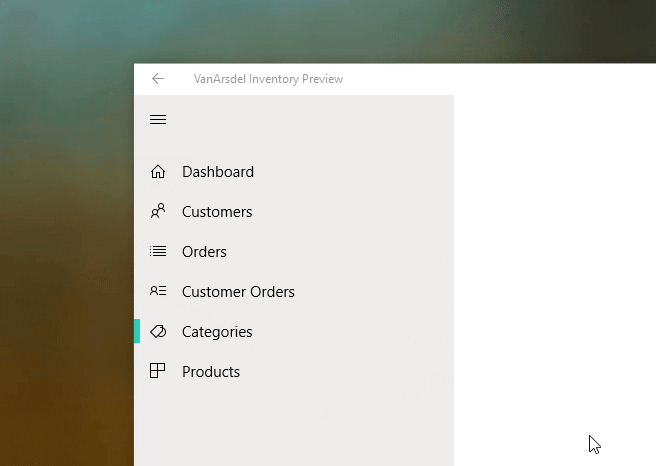

## Using Fluent Design
### Animations
Animations are a main concept in Fluent Design. Well-designed animations will make your application a living ecosystem. For example, an element thas has been selected can **zoom in to fill a view**, instead of switching views suddenly, that will help the user understand where it came from. 

In the Universal Windows platform, almost everything can be animated easily. This advantage is well understood in Fluent Design, taking the most out of it to fullfil its principles.

Animations have never been easier. You can add them declaratively in XAML. This is the preferred way to do it, since we encourage adhering to the MVVM architectural pattern where the separation of concers is key. Animations aren't an exception.
### Built-in animations

Depending on which control we are using, animations can be used almost with no effort because they already ready to be used. We will detail some of the most important.

#### Frame
`Frame` is a handy control to handle navigation between different contents. In  the improve the experience, we can make it use animations that will be applied to the content being navigated. To do it, just specify a transition animation in its `ContentTransitions`:

```xml
<Frame x:Name="frame">
    <Frame.ContentTransitions>
        <TransitionCollection>
            <NavigationThemeTransition />
        </TransitionCollection>
    </Frame.ContentTransitions>
</Frame>
```

**Notice** that the `ContentTranstions` is a `TransitionCollection`, that will have our transtions.

By setting Frame.ContentTranstions, you are specifying that each time the Frame navigates to some content, a transition animation will play to show the content in an elegant way. This snipped uses the default animation, which makes the content fade in while sliding partially from the bottom to the top of the view.

You can set other animations, like the *DrillInNavigation* animation:
```xml
<Frame x:Name="frame">
    <Frame.ContentTransitions>
        <TransitionCollection>
            <NavigationThemeTransition>
                <NavigationThemeTransition.DefaultNavigationTransitionInfo>
                    <DrillInNavigationTransitionInfo />
                </NavigationThemeTransition.DefaultNavigationTransitionInfo>
            </NavigationThemeTransition>
        </TransitionCollection>
    </Frame.ContentTransitions>
</Frame>
```

This time, the content will zoom in until the view is filled with it in a fast, decelerating pace.

You can learn more about **Frame Content Transitions** [in this page](https://docs.microsoft.com/en-us/uwp/api/Windows.UI.Xaml.Media.Animation.NavigationThemeTransition)

#### ItemsControl (ListView)
`ListView`, along with classes derived from `ItemsControl` have a special property to add built-in animations called `ItemContainerTransitions`. In contrast with `Frame`, `ListView` uses the built-in transtion by default, so you don't have to do anything to use them. You may explicitly set it using a XAML similar to this:
```xml
<ListView Grid.Row="1" ItemsSource="{Binding People}">
    <ListView.ItemContainerTransitions>
        <TransitionCollection>
            <AddDeleteThemeTransition />
        </TransitionCollection>
    </ListView.ItemContainerTransitions>
</ListView>
```
The `AddDeleteTransition` is the default. It will apply a horizontal sliding fade in / fade out animation to the items of the ListView as the are added/removed. There are more, like PopupThemeTransition, that will do the same, but vertically.

#### Other controls

Other controls use animations automatically because they are part of their templates. You don't have to do anything and will look and interact like the should according to the Fluent Design.

For example, elements in a `ListView` will automatically use effects like **Reveal**.

#### Reveal

Reveas is a brand new effect that aligns perfectly with the precepts of Fluent Design. It offers lighning effects over Acrylic surfaces that offert a great visual appearance and reacts to user input, like mouse hovers, taps and clicks.



A number of basic controls will use reveal effects/animations automatically.

- [**ListView**](https://docs.microsoft.com/es-es/windows/uwp/design/controls-and-patterns/lists)
- [**GridView**](https://docs.microsoft.com/es-es/windows/uwp/design/controls-and-patterns/lists)
- [**TreeView**](https://docs.microsoft.com/es-es/windows/uwp/design/controls-and-patterns/tree-view)
- [**NavigationView**](https://docs.microsoft.com/es-es/windows/uwp/design/controls-and-patterns/navigationview)
- [**AutosuggestBox**](https://docs.microsoft.com/es-es/windows/uwp/design/controls-and-patterns/auto-suggest-box)
- [**MediaTransportControl**](https://docs.microsoft.com/es-es/windows/uwp/design/controls-and-patterns/media-playback)
- [**CommandBar**](https://docs.microsoft.com/es-es/windows/uwp/design/controls-and-patterns/app-bars)
- [**ComboBox**](https://docs.microsoft.com/es-es/windows/uwp/design/controls-and-patterns/lists)

However, there are other controls that doesn't have the reveal style by default. Fortunately, Reveal can be enabled using a predefined set of styles.

##### Enabling Reveal on other common controls

These are the controls that can use Reveal using a `Style`.

| Control Name   | Resource Name |
|----------|:-------------:|
| Button |  ButtonRevealStyle |
| ToggleButton | ToggleButtonRevealStyle |
| RepeatButton | RepeatButtonRevealStyle |
| AppBarButton | AppBarButtonRevealStyle |
| SemanticZoom | SemanticZoomRevealStyle |

To illustrate with an example, this is a XAML snippet of a Button with Reveal enabled.


#### Connected animations

##### What's a connected animation?

It's an an animation that applies to a transition of an element between 2 different views.

To illustrate it, nothing is better than seeing it in action.


In the animation, you can see that the tapped item of the initial view is a child item of a list, but after the tap, it becomes the header of the new view. This is what connected animations do: one element is connected and animated during the transition.

The need for this new feature is imposed by the standards of Fluent Design. Transitions should be exactly that: fluent. This means that, apart from offering moving elements that combine perfectly, the transition between views should convey context. This is, that the user should perceive an animation that shows how those elements are linked, as part of a flow, with each navigation / change in the view.

##### What's a connected animation?

Where should they be used?

Connected animations are useful when switching views. They usually are a replacement for the Drill-in transition, and take one shared element between the two views.

##### Implementation

It's consists of 2 steps:
- Prepare
- Start

In the Prepare step, you indicate the system which element of the source view will participate in the connected animation.

You can do it with this code:

```csharp
ConnectedAnimationService.GetForCurrentView().PrepareToAnimate("image", SourceImage);
```

`SourceImage` is the name of the element that will participate in the connected animation and `"image"` is the name of the animation. You can see it as the "key" of the animation.

The next step, Start is where the actual animation takes place. To make it work, you have to call the animation TryStart method:

```csharp
  ConnectedAnimation imageAnimation = 
        ConnectedAnimationService.GetForCurrentView().GetAnimation("image");
    if (imageAnimation != null)
    {
        imageAnimation.TryStart(DestinationImage);
    }
```

##### Connected animations in ListViews and GridViews

Both controls have 2 new methods to animate their items in order to facilitate the creation of connected animations from / to them.

 - ***PrepareConnectedAnimation***
 - ***TryStartConnectedAnimationAsync***

In order to prepare a connected animation from an item, call the `ConnectedAnimationService` like this:

```csharp
void PrepareAnimationWithItem(Person item)
{
     ContactsListView.PrepareConnectedAnimation("portrait", item, "PortraitEllipse");
}
```

Where `item` is the Data Item in the `ListView`/`GridView`. The Data Item is the type of the instance that handling the `ListView`/`GridView`. For instance: A ListView can be bound to a `Collection<Person>` called People. Then, the DataItem is the instance of Person that is represented by the item.

Alternatively, to start the connected animation with an item of a `ListView`/`GridView` as the target (destination) of an animation, for example, when coming back from a detail to the view containing the "hosting" `ListView`/`GridView`, in the destination view we should call the TryStartConnectedAnimationAsync control hosting the item, like this:

```csharp
private void ContactsListView_Loaded(object sender, RoutedEventArgs e)
{
    ContactsItem item = GetPersistedItem(); // Get persisted item
    if (item != null)
    {
        ContactsListView.ScrollIntoView(item);
        ConnectedAnimation animation = 
            ConnectedAnimationService.GetForCurrentView().GetAnimation("portrait");
        if (animation != null)
        {
            await ContactsListView.TryStartConnectedAnimationAsync(
                animation, item, "PortraitEllipse");
        }
    }
}
```

Take into account that this method is the handler of the `Loaded` event, so it will be invoked as soon as the `ListView`/`GridView` is loaded.

In the first line, we are retrieving the item that is the target of the animation (the Data Item, as Person in the example we said previously)

After we have the item, we scroll to it and get the connected animation (with the key).

Finally, we call the `TryStartConnectedAnimationAsync` on the ContactList, that is a `ListView` or a `GridView`, with the correct arguments (the given animation, the item and the name of the element that is shared between origin and destination views.