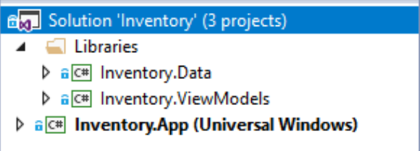
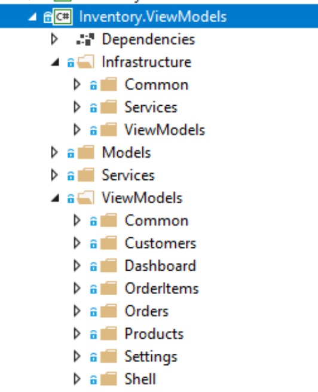

# Introduction

Developers of enterprise apps face several challenges:
- App requirements that can change over time.
- New business opportunities and challenges.
- Ongoing feedback during development that can significantly affect the scope and requirements of the app.

With these in mind, it's important to build apps that can be easily modified or extended over time. Designing for such adaptability can be difficult as it requires an architecture that allows individual parts of the app to be independently developed and tested in isolation without affecting the rest of the app.

An effective remedy for these challenges is to partition an app into discrete, loosely coupled components that can be easily integrated together into an app. Such an approach offers several benefits:
- It allows individual functionality to be developed, tested, extended, and maintained by different individuals or teams.
- It promotes reuse and a clean separation of concerns between the app's horizontal capabilities, such as authentication and data access, and the vertical capabilities, such as app specific business functionality. This allows the dependencies and interactions between app components to be more easily managed.
- It helps maintain a separation of roles by allowing different individuals, or teams, to focus on a specific task or piece of functionality according to their expertise. In particular, it provides a cleaner separation between the user interface and the app's business logic.

Before proceeding to decoupled the app in different components, it's important to choose the design patterns that will help us to do it properly. These are the patterns we have decided to choose for the Inventory App:

- [Model-View-ViewModel (MVVM)](mvvm.md): Windows 10 enterprise apps are specially design to apply this pattern for decoupled the business logic, the presentation logic and the UI views.
- [Dependency Injection](architecture/app-initial-setup.md#Dependency-Injection): Dependency injection containers reduce the dependency coupling between objects by providing a facility to construct instances of classes with their dependencies injected, and manage their lifetime based on the configuration of the container.
- [Communication between loosely coupled components](architecture/message-service.md): Message-based communication between components that are inconvenient to link by object and type references.
- [Navigation](navigation-service.md#Navigation-Service): Define how the Navigation will work, and where the Navigation logic will reside.
- [Data Access](dataaccess.md): We need to define how we are going to connect with our data sources and the technology to use for that purpose.

This guide not only explain in detail each of the patterns used, it also shows you how are being applied in the Inventory Sample app.

## The Inventory Sample app

The purpose of the Invetory Sample app is to provide an example of Windows 10 enterprise app implementation. This app manages the Van Arsdel store, including customers, products, orders, etc. 

 

 App's solution has been divided in three decoupled projects, and each of them represents and important role in the app:

 | Project | Description |
 | ------- | ----------- |
 | Inventory.Data | [.Net Standard](netstandard.md) project that represents the data access logic of the app |
 | Inventory.ViewModels | [.Net Standard](netstandard.md) project representing the business and the presentation logic of the app |
 | Inventory.App | This is the Windows 10 app, where *User Interface Views* are located |

 ### The Inventory.ViewModels folders

 

 | Folder | Description |
 | ------ | ----------- |
 | Infrastructure | This folder will contain the [infrastructure services](architecture/infrastructure-services.md#Infrastructure-services) as well as the base logic of the ViewModels |
 | Models | Application Domain models |
 | Services | Application Domain Services |
 | ViewModels | ViewModels classes that represents the presentation logic of the app |

